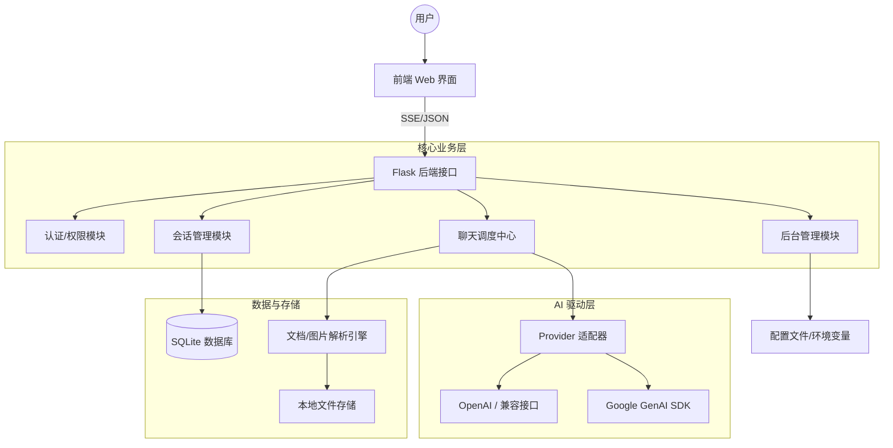

# Gtp-Web MVP


Gtp-Web MVP 是一个简约而不简单的多用户 AI 聊天 Web 平台。它专注于核心聊天体验，通过服务器端配置实现多模型调度、附件解析及会话持久化，适合个人或团队内部作为轻量级 AI 交互门户使用。

## 🌟 核心特性

- **多用户隔离**：预置账号系统，支持管理员权限划分，聊天记录按账号存储于 SQLite。
- **多模型驱动**：同时支持 OpenAI（兼容所有标准接口）与 Google Gemini（原生 SDK 接入）。
- **深度思考支持**：内置对 OpenAI `reasoning` 与 Gemini `thinking` 参数的精细化配置。
- **全能附件解析**：支持图片识别及多种文档格式（PDF、Word、Excel、TXT）的智能解析。
- **流式交互**：基于 SSE（Server-Sent Events）的高性能流式文本输出。
- **高效管理**：内置 Web 后台，支持在线编辑配置文件（`.env` / `.jsonc`）并热更新生效。

---

## 🚀 快速开始

只需 4 步即可在本地运行您的 AI 聊天站：

```bash
# 1. 克隆并进入目录
git clone https://github.com/your-repo/Gtp-Web.git && cd Gtp-Web

# 2. 安装依赖 (建议使用虚拟环境)
python3 -m venv .venv && source .venv/bin/activate
pip install -r requirements.txt

# 3. 初始化配置
cp -R config/env.example config/env
cp config/users.example.json config/users.json
# 注：请编辑 config/env/*.env 填入您的 API Key

# 4. 启动服务
python app.py
```
访问：`http://127.0.0.1:8000` | 默认账号请参考 `config/users.json`

---

## 🏗️ 技术架构



---

## ⚙️ 详细配置指南

### 1. 环境变量配置 (`config/env/*.env`)

本项目采用分组环境变量管理，系统会自动扫描 `config/env` 目录下的 `.env` 文件。

| 文件名 | 关键变量 | 说明 |
| :--- | :--- | :--- |
| `app.env` | `APP_SECRET_KEY`, `PORT` | Flask 密钥与运行端口 |
| `openai.env` | `OPENAI_API_KEY`, `OPENAI_BASE_URL` | 支持 OpenAI 及所有兼容网关 |
| `google.env` | `GOOGLE_API_KEY`, `GOOGLE_BASE_URL` | Gemini 官方密钥及可选代理地址 |
| `storage.env`| `CHAT_DB_FILE`, `UPLOAD_DIR` | 数据库与附件存储路径 |
| `logging.env`| `LOG_LEVEL`, `LOG_TO_STDOUT` | 日志详细程度及输出方式 |
| `attachments.env` | `MAX_UPLOAD_MB`, `ALLOWED_ATTACHMENT_EXTS` | 附件大小限制与扩展名白名单 |

### 2. 模型清单配置 (`config/models.jsonc`)

通过 JSONC（带注释的 JSON）统一管理所有 AI 模型的特性。

```jsonc
{
  // OpenAI 模型配置
  "openai": {
    "image_model": "",
    "defaults": {
      "reasoning": {
        "enabled": false
      }
    },
    "models": [
      {
        "name": "gpt-4o-mini",
        "label": "GPT-4o Mini",
        "reasoning": {
          "enabled": false
        }
      },
      {
        "name": "o1-preview",
        "label": "O1 推理模型",
        "reasoning": {
          "enabled": true,
          "effort": "medium",
          "effort_options": ["low", "medium", "high"],
          "summary": "auto"
        }
      }
    ]
  },
  // Google Gemini 模型配置
  "google": {
    "image_model": "gemini-3.1-flash-image-preview",
    "defaults": {
      "thinking": {
        "enabled": false
      }
    },
    "models": [
      {
        "name": "gemini-2.0-flash",
        "label": "Gemini 2.0 Flash",
        "thinking": {
          "enabled": false
        }
      },
      {
        "name": "gemini-2.0-flash-thinking-exp",
        "label": "Gemini 2.0 Thinking",
        "thinking": {
          "enabled": true,
          "budget": 16000,
          "include_thoughts": true,
          "level": "high",
          "level_options": ["medium", "high"]
        }
      }
    ]
  }
}
```

**配置说明：**

- **OpenAI Reasoning 参数**：
  - `enabled`: 是否启用推理模式
  - `effort`: 推理强度（`low`/`medium`/`high`）
  - `effort_options`: 可用的推理强度选项
  - `summary`: 推理摘要级别（`auto`/`concise`/`detailed`）

- **Gemini Thinking 参数**：
  - `enabled`: 是否启用思考模式
  - `include_thoughts`: 是否将思考过程返回给前端
  - `level`: 思考级别（`low`/`medium`/`high`）
  - `level_options`: 可用的思考级别选项
  - `budget`: 思考 token 预算（适用于部分模型）

**会话内部保存的是带来源前缀的模型 ID**，例如 `openai:gpt-4o-mini`、`google:gemini-2.0-flash`。

### 3. 用户配置 (`config/users.json`)

预置登录账号、密码和管理员权限。

```json
{
  "users": [
    {
      "username": "admin",
      "password": "ChangeThis123",
      "is_admin": true
    },
    {
      "username": "alice",
      "password": "AlicePass123",
      "is_admin": false
    }
  ]
}
```

**安全提示**：MVP 版本使用明文密码存储，生产环境建议改为密码哈希。

---

## 🚢 自动化部署

项目内置了 `deploy.sh` 脚本，支持通过 SSH 一键将本地配置与代码同步至远程服务器。

### 1. 准备部署配置
```bash
cp config/deploy.example.env config/deploy.env
```

编辑 `config/deploy.env`：

```bash
# 远程服务器连接信息
DEPLOY_HOST=your-server.com
DEPLOY_PORT=22
DEPLOY_USER=deploy
DEPLOY_PASSWORD=your-password  # 可选：使用 sshpass 免密登录

# 远程项目信息
REMOTE_DIR=/opt/Gtp-Web
REMOTE_GIT_BRANCH=main

# 本地 Git 信息
LOCAL_GIT_BRANCH=main

# 远程启停命令
REMOTE_STOP_CMD="pkill -f 'python app.py'"
REMOTE_START_CMD="cd /opt/Gtp-Web && nohup python app.py > logs/app.log 2>&1 &"

# 配置同步选项
SYNC_LOCAL_CONFIG=1  # 是否同步本地配置到远程
LOCAL_ENV_DIR=./config/env
LOCAL_USERS_FILE=./config/users.json
REMOTE_ENV_DIR=./config/env
REMOTE_USERS_FILE=./config/users.json
```

### 2. 运行部署
```bash
# 执行自动化流水线：Git Push -> SSH Connect -> Git Pull -> Config Sync -> Restart
bash deploy.sh
```

**功能说明：**
- **免密支持**：配置 `DEPLOY_PASSWORD` 后使用 `sshpass` 自动登录，或留空使用 SSH Key。
- **配置同步**：默认同步本地 `config/env` 与 `config/users.json` 到远程，确保环境一致性。
- **服务重启**：自动执行远程停止与启动命令（支持 `pm2`、`systemctl` 或自定义脚本）。
- **安全性**：`config/deploy.env` 已加入 `.gitignore`，避免将真实服务器密码提交到仓库。

---

## 🛠️ 后台管理

管理员账号（在 `users.json` 中 `is_admin: true`）登录后可进入 `/admin` 面板：

- **实时编辑**：直接修改各分组 `.env` 环境变量。
- **用户管理**：在线增减用户、修改密码及权限。
- **模型配置**：直接编辑 `models.jsonc`，保存后即时热更新模型列表。
- **热更新**：保存后系统即时写盘，部分配置（如模型列表）无需重启即可生效。

**安全机制**：如果当前管理员在配置中被移除或取消管理员权限，系统会拒绝保存，避免误操作导致自己被锁定。

---

## 📂 项目结构

```
gtpweb/
├── blueprints/        # 业务路由模块
│   ├── __init__.py
│   ├── auth.py        # 认证与登录页面路由
│   ├── admin.py       # 后台管理路由
│   ├── conversation.py# 会话管理路由
│   └── chat.py        # 聊天流式路由
├── __init__.py        # 包初始化文件
├── ai_providers.py    # 多来源模型注册与 Gemini 转换逻辑
├── app_factory.py     # Flask 应用装配
├── assistant_actions.py # AI 助手工具函数和 Action 支持
├── attachments.py     # 附件校验与 Word/Excel 解析引擎
├── config.py          # 动态环境配置加载器
├── db.py              # SQLite 交互层
├── jsonc.py           # JSONC 解析器（支持注释）
├── logging_config.py  # 日志配置
├── openai_stream.py   # SSE 流式输出封装
├── routes.py          # 路由注册兼容层
├── runtime_state.py   # 运行时状态管理
├── user_store.py      # 用户配置加载
└── utils.py           # 通用工具函数
app.py                 # 程序主入口
deploy.sh              # SSH 自动部署脚本
run_linux.sh           # Linux 启动脚本
stop_linux.sh          # Linux 停止脚本
```

**数据库表结构：**

- `conversations`: 对话记录（用户、标题、模型、推理设置等）
- `messages`: 消息记录（角色、内容、推理过程、状态等）
- `message_attachments`: 消息附件（文件名、路径、MIME 类型、解析文本等）

---

## 🧪 测试

```bash
pip install -r requirements-dev.txt
pytest
```

测试目录：

- `tests/unit/`: 纯函数与工具层测试
- `tests/integration/`: 蓝图接口行为测试

---

## 🔍 故障排查 (FAQ)

### 前端返回 HTML 代码而非 JSON
**现象**：前端提示 `<!DOCTYPE html>...`

**原因**：上游 API 返回了 HTML 错误页，而非预期的 JSON 响应。

**排查步骤**：
1. 检查 `OPENAI_BASE_URL` 是否为网关 API 根地址（通常以 `/v1` 结尾）
2. 确认 API Key 是否正确
3. 查看日志 `./logs/chat.log` 获取详细错误信息

### Gemini 模型无法调用
**现象**：使用 Gemini 模型时调用失败

**排查步骤**：
1. 确认 `GOOGLE_API_KEY` 有效且未过期
2. 检查 `config/models.jsonc` 中的模型 ID 是否匹配官方列表
3. 如果使用代理或网关，确认 `GOOGLE_BASE_URL` 填写正确
4. 确认当前 Python 环境已安装 `google-genai` 依赖

### 如何查看详细请求日志？
**说明**：每个请求都有 `rid=<request_id>`，响应头同步返回 `X-Request-ID`，可进行全链路追踪。

**日志文件**（按类别分文件输出到 `./logs/`）：
- `app.log`: 启动与基础设施日志
- `request.log`: 请求入口/出口与耗时
- `auth.log`: 登录与登出
- `conversation.log`: 会话管理与导出
- `chat.log`: 聊天流式与附件处理
- `error.log`: 全局 `WARNING/ERROR` 汇总

---

## 📋 项目边界与限制

- **安全性**：账号密码为配置文件明文（MVP 版，建议后续改为哈希）
- **附件支持**：已支持 `.doc`/`.docx`/`.xls`/`.xlsx` 文档解析（`.doc` 为尽力解析，推荐 `.docx`）
- **安全限制**：非白名单扩展名会被后端严格拒绝
- **会话管理**：暂不支持会话归档/标签管理
- **数据库**：SQLite 不适合高并发场景

---

## 📈 后续规划

- [ ] 接入密码哈希存储（提升安全性）
- [ ] 支持更多 AI Provider（Anthropic Claude / Azure OpenAI / DeepSeek 等）
- [ ] 增加会话标签管理与批量导出功能
- [ ] 支持 PDF 深度解析插件
- [ ] 支持数据库迁移到 PostgreSQL/MySQL
- [ ] 增加审计日志与配置变更历史
- [ ] 支持导出为 PDF/Markdown 格式

---

## 📄 许可证

本项目采用 MIT 许可证。

---

*Powered by Gemini CLI & OpenClaw*
